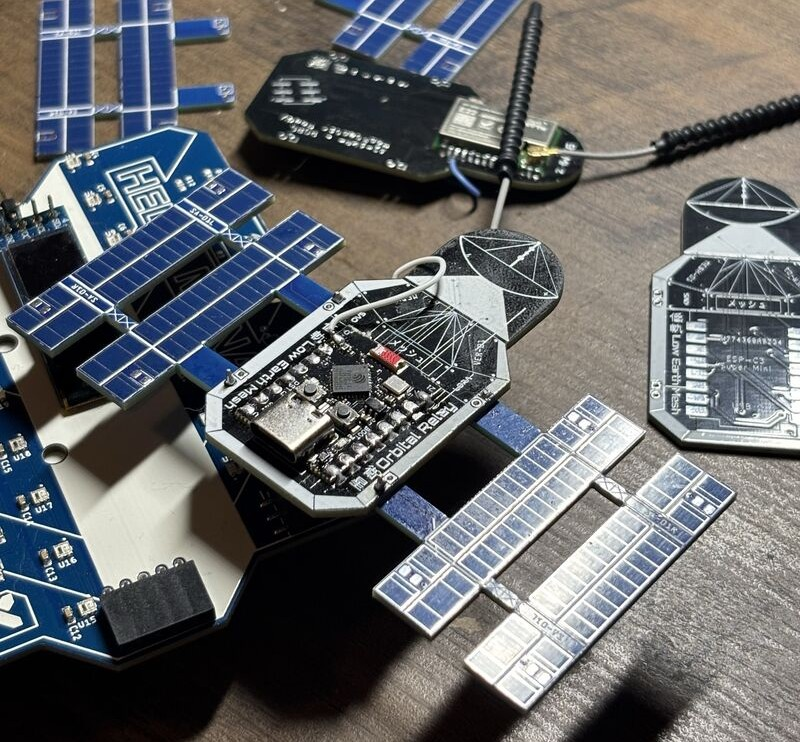

# L.E.M - Low Earth Mesh 🛰️

Custom Meshtastic firmware and build/flash guide for the **L.E.M SAO** (Shitty Add-On), a LoRa Meshtastic node.

- **Target hardware**: ESP32-C3 Super Mini + E22-900M22S (SX1262), discrete/non-standard wiring.
- **Validated state**: firmware `2.8.0.8a0c759`, environment `lem-esp32c3-sx1262`, ROUTER node operational.

> **Why a custom build instead of the web flasher**: the LoRa pins are baked into `variant.h` at compile time and aren't configurable from the app. No pre-built target matches this discrete C3 + E22 wiring.



## Repository structure

```
LowEarthMesh/
├── README.md            this guide
├── LICENSE              GPL-3.0 (this project derives from Meshtastic firmware)
├── variant/lem/
│   ├── variant.h         reference pin/radio config, diff it against your own board
│   └── platformio.ini    reference build environment, diff it against your own board
└── docs/                 hardware docs (BOM, wiring), coming later
```

The `variant/lem/` files are a **reference**. Wiring can vary between individual builds (especially the GPIO9 strapping-pin bodge below), diff them against your own board before flashing.

## 0. Prerequisites (Windows)

- **Git** (added to PATH during install).
- **VS Code** + **PlatformIO IDE** extension (bundles its own Python, no separate install needed).
- Optional but recommended: Microsoft's **Serial Monitor** extension (see [Monitoring](#7-serial-monitoring), PlatformIO's built-in monitor is flaky on the C3's USB-JTAG).

## 1. Clone the Meshtastic firmware

```sh
git clone --recurse-submodules https://github.com/meshtastic/firmware.git
cd firmware
git submodule update --init
```

Open the `firmware` folder in VS Code (the one containing the root `platformio.ini`).

## 2. Add the custom variant

Copy this repo's `variant/lem/` folder into the firmware tree at:

```
variants/esp32c3/lem/
```

If you're starting from scratch instead of using the reference files here, base it on one of:

- **Recommended clean base**: `variants/esp32c3/diy/esp32c3_super_mini` (built for this board, already handles USB CDC, I2C, and the lack of a screen).
- **Base used for the validated build**: `variants/esp32c3/heltec_esp32c3`, patched with the flags below.

## 3. `platformio.ini`

`variants/esp32c3/lem/platformio.ini` (see [reference](variant/lem/platformio.ini)):

```ini
[env:lem-esp32c3-sx1262]
extends = esp32c3_base
board = esp32-c3-devkitm-1
build_flags =
  ${esp32c3_base.build_flags}
  -D PRIVATE_HW
  -D MESHTASTIC_EXCLUDE_SCREEN=1     ; no OLED on this board. Avoids the 'Wire1 not declared' bug (C3 has a single I2C bus)
  -D ARDUINO_USB_MODE=1              ; console on the native USB Serial/JTAG
  -D ARDUINO_USB_CDC_ON_BOOT=1       ; route Serial to USB CDC at boot. Otherwise logs go to UART0 and the USB terminal stays silent
  -D WIFI_DISABLED=1                 ; intended to free up BLE (not confirmed necessary, see Notes)
  -I variants/esp32c3/lem
monitor_speed = 115200
upload_protocol = esptool
upload_speed = 921600
```

Key points if adapting: environment header `[env:lem-esp32c3-sx1262]`, identity `PRIVATE_HW` (no official model), and `-I` pointing at the new folder.

## 4. `variant.h` (pins and radio)

`variants/esp32c3/lem/variant.h` (see [reference](variant/lem/variant.h)):

```c
#define HW_VENDOR meshtastic_HardwareModel_PRIVATE_HW
#define USE_SX1262

// SPI bus
#define LORA_SCK   4
#define LORA_MISO  5
#define LORA_MOSI  6
#define LORA_CS    7

// SX1262 control
#define SX126X_CS     7
#define SX126X_RESET  3
#define SX126X_DIO1   10
#define SX126X_BUSY   0    // BODGE: was GPIO9. GPIO9 is a strapping pin, moved to GPIO0
#define SX126X_RXEN   21   // RF switch RX (external E22 PA/LNA)
#define SX126X_TXEN   20   // RF switch TX

// E22: TCXO on DIO3, required or radio init fails
#define SX126X_DIO3_TCXO_VOLTAGE 1.8
#define TCXO_OPTIONAL              // fall back to XTAL if TCXO init fails

// Super Mini builtin LED (active LOW)
#define LED_PIN 8
```

> Do **not** define `SX126X_DIO2_AS_RF_SWITCH`: TXEN/RXEN handle the switch here.
> If the LED is inverted after flashing, add `#define LED_STATE_ON 0`.

## 5. Build

Use the **PlatformIO Core CLI** terminal (alien icon > Open terminal, or the full path to `pio`). A plain PowerShell won't have `pio` on PATH.

```sh
pio run -e lem-esp32c3-sx1262
```

First build: 20-40 min (toolchain + framework download). Later builds are cached.
Ignore `warning:` lines. Only `*** Error` or `FAILED` matter.

## 6. Flash

Connect the board over **USB-C** (never SAO and USB-C at the same time). Then:

```sh
pio run -e lem-esp32c3-sx1262 -t upload --upload-port COM7
```

This writes the bootloader, partition table, and app together. The LittleFS partition formats itself on first boot.

If needed, force the filesystem partition:

```sh
pio run -e lem-esp32c3-sx1262 -t uploadfs --upload-port COM7
```

**Entering download mode** (auto-reset is unreliable over native USB with `CDC_ON_BOOT`): if flashing hangs on `Connecting....____`, hold **BOOT**, tap **RST**, release **BOOT**, then retry.

## 7. Serial monitoring

PlatformIO's built-in monitor can loop on `ClearCommError failed` against the C3's USB-JTAG on Windows. Two options:

- **Recommended**: VS Code **Serial Monitor** extension (Microsoft). Port COM7, baud 115200, Start Monitoring. It reconnects after USB re-enumeration.
- PlatformIO: `pio device monitor -e lem-esp32c3-sx1262 -p COM7` (less robust here).

Don't press the physical RST button while monitoring over native USB: RST also resets the USB controller and drops the connection.

**What to look for at boot**: `SX1262 init result 0` or equivalent. `result 0` = radio OK, SPI wiring is good.

## 8. Network configuration (runtime)

Via the Meshtastic app over **BLE** (no screen on this board):

- **Region**: US (915MHz)
- **Role**: ROUTER

BLE pairing PIN: since the board has no screen, it defaults to FIXED_PIN (default `123456`, change it).

- Runtime: `meshtastic --set bluetooth.fixed_pin 654321` or via the app.
- Compile-time (for a batch of boards): `userPrefs.jsonc` at the firmware root, key `"USERPREFS_FIXED_BLUETOOTH": "654321"`. Only applies to a board with no stored config (fresh flash or factory reset).

## Troubleshooting

| Symptom | Cause | Fix |
|---|---|---|
| `'Wire1' was not declared` (AutoOLEDWire.h) | C3 has a single I2C bus, the OLED driver expects a second one | `-D MESHTASTIC_EXCLUDE_SCREEN=1`, or base on `diy/esp32c3_super_mini` |
| `Unknown environment 'lem-...'` | typo in `[env:...]` header or folder not detected | check the header and the folder location |
| Compiles OK but radio is dead | `-I` still points at the old folder | fix `-I variants/esp32c3/lem` |
| `'pio' is not recognized` | plain PowerShell, not the PlatformIO PATH | use the PlatformIO Core CLI terminal, or the full path to `pio.exe` |
| Flash stuck on `Connecting....____` | auto-reset unreliable over native USB | BOOT + RST + release BOOT, retry |
| No serial log (board is alive) | console on UART0 | `-D ARDUINO_USB_MODE=1` + `-D ARDUINO_USB_CDC_ON_BOOT=1` |
| No BLE | board not booting (strapping) or WiFi init | fix the GPIO9 strapping issue, `WIFI_DISABLED=1` |
| Board dead, download mode only | GPIO9 strapping pin held low by an external signal | cut the trace and reroute to a non-strapping pin (V1 only) |
| `ClearCommError` / reconnect loop | pyserial + C3 USB-JTAG bug on Windows | Microsoft's Serial Monitor extension |
| Monitor drops on RST | RST also resets native USB | don't press RST while monitoring |
| COM port changes after reflash | firmware creates its own CDC device | recheck the port number |
| Panic / slow boot (filesystem) | LittleFS partition missing | `-t upload` (writes partitions) and/or `-t uploadfs` |

## Notes

- `WIFI_DISABLED=1`: necessity not confirmed. Applied alongside the GPIO9 hardware fix, the two haven't been isolated. Verify the flag is recognized by the build.
- Strapping-pin rule: never route an external signal with an uncertain reset-time state onto GPIO2, GPIO8, or GPIO9.

## License

This project derives from [Meshtastic firmware](https://github.com/meshtastic/firmware) and is distributed under **GPL-3.0** (see [LICENSE](LICENSE)).

## Official resources

| Doc | URL |
|---|---|
| Build firmware from source | https://meshtastic.org/docs/development/firmware/build/ |
| Flashing firmware | https://meshtastic.org/docs/getting-started/flashing-firmware/ |
| Bluetooth settings | https://meshtastic.org/docs/configuration/radio/bluetooth/ |
| Meshtastic firmware repo | https://github.com/meshtastic/firmware |
| `userPrefs.jsonc` | https://github.com/meshtastic/firmware/blob/master/userPrefs.jsonc |
